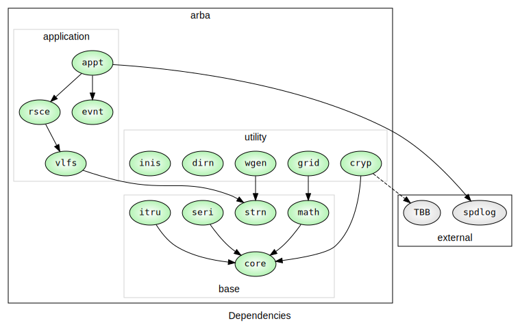

# Concept

*arba-arba* is a project embedding several tiny C++ library projects:

| library                                              | version | library                                              | version | library                                              | version |
| ---------------------------------------------------- | ------- | ---------------------------------------------------- | ------- | ---------------------------------------------------- | ------- |
| [`arba-core`](https://github.com/arapelle/arba-core) | 0.14.0  | [`arba-grid`](https://github.com/arapelle/arba-grid) | 0.3.0   | [`arba-vlfs`](https://github.com/arapelle/arba-vlfs) | 0.2.0   |
| [`arba-strn`](https://github.com/arapelle/arba-strn) | 0.2.0   | [`arba-wgen`](https://github.com/arapelle/arba-wgen) | 0.2.0   | [`arba-rsce`](https://github.com/arapelle/arba-rsce) | 0.2.0   |
| [`arba-seri`](https://github.com/arapelle/arba-seri) | 0.4.0   | [`arba-dirn`](https://github.com/arapelle/arba-dirn) | 0.2.0   | [`arba-evnt`](https://github.com/arapelle/arba-evnt) | 0.3.0   |
| [`arba-math`](https://github.com/arapelle/arba-math) | 0.4.0   | [`arba-inis`](https://github.com/arapelle/arba-inis) | 0.2.0   | [`arba-appt`](https://github.com/arapelle/arba-appt) | 0.12.0  |
|                                                      |         | [`arba-cryp`](https://github.com/arapelle/arba-cryp) | 0.3.0   |                                                      |         |



# Install

## Requirements

Binaries:

- A C++20 compiler (ex: g++-13)
- CMake 3.26 or later

Libraries:
- [spdlog](https://github.com/gabime/spdlog) 1.8 or later (for appt)
- [TBB](https://github.com/oneapi-src/oneTBB) 2017 or later (only for using cryp with parallelization)

Testing Libraries (optional):
- [Google Test](https://github.com/google/googletest) 1.13 or later (optional)

## Clone

```
git clone https://github.com/arapelle/arba-arba --recurse-submodules
```

## Quick Install

There is a cmake script at the root of the project which builds the library in *Release* mode and install it (default options are used).

```
cd /path/to/arba-arba
cmake -P cmake/scripts/quick_install.cmake
```

Each library (arba-strn, arba-wgen, ...) is installed independently.

Use the following to quickly install a different mode and specify the install directory.

```
cmake -P cmake/scripts/quick_install.cmake -- TESTS BUILD Debug DIR /tmp/local
```

## Uninstall

There is a uninstall cmake script created during installation. You can use it to uninstall properly arba libraries.

```
cd /path/to/installed-arba-arba/
cmake -P uninstall.cmake
```

It will remove all arba libraries! So, if you want to uninstall only one of them, execute the `uninstall.cmake` script of the library you want to remove.

# License

[MIT License](https://github.com/arapelle/arba/blob/master/LICENSE.md) © arba-arba
